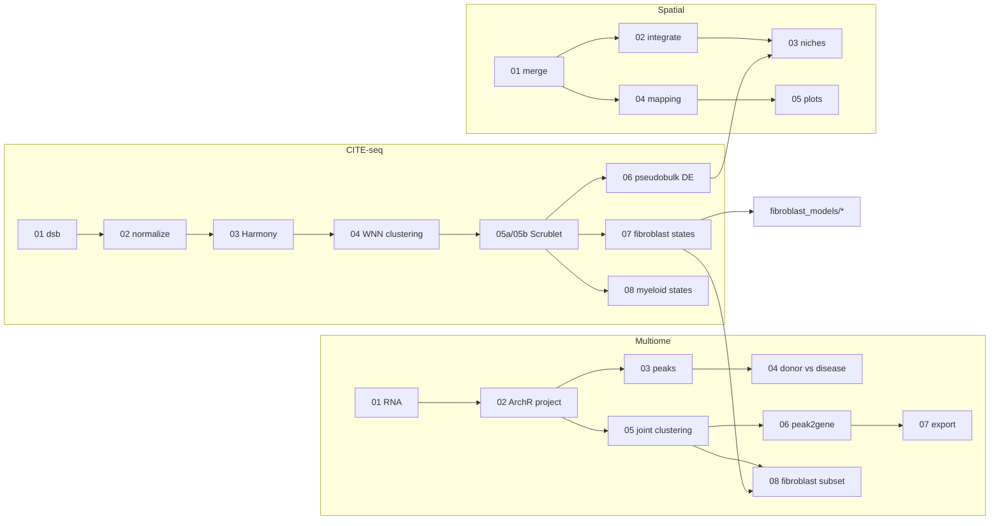

# Targeting immune–fibroblast cell communication in heart failure

[](https://doi.org/10.1038/s41586-024-08008-5)
[](LICENSE)

Analysis code for **Amrute, Luo *et al.*, *Nature* 635, 423–433 (2024)**.

We profiled healthy donor, acutely infarcted and chronically failing human hearts with CITE-seq
(single-cell RNA plus surface protein) and single-nucleus multiome (paired RNA and chromatin
accessibility). A disease-associated fibroblast trajectory diverges into myofibroblasts and
FAP⁺/POSTN⁺ fibroblasts that resemble matrifibrocytes, and lineage tracing shows that FAP⁺
fibroblasts give rise to the POSTN lineage. Mouse models of cardiac injury reproduce the human
fibroblast states better than cultured fibroblasts. Spatial transcriptomics and cell-specific
deletion experiments show that IL-1β from CCR2⁺ macrophages signals directly to fibroblasts to drive
FAP/POSTN fibroblast specification and cardiac fibrosis.

---

## Repository structure

```
.
├── human_citeseq/        CITE-seq atlas: preprocessing, clustering, fibroblast and myeloid states
├── multiome/             Single-nucleus multiome (RNA + ATAC, ArchR)
├── fibroblast_models/    Mouse injury models, cultured and cross-tissue fibroblasts vs human states
├── spatial/              Visium spatial transcriptomics
├── metadata/             Sample sheets read by the loaders (multiome and Visium samples)
├── R/                    Shared helper functions (utils.R)
├── environment/          R package installer and conda environment
├── CITATION.cff
└── LICENSE
```

Scripts are numbered in run order within each folder. Every script starts with a header (R scripts) or
an introduction (notebooks) describing its purpose, inputs, outputs and upstream/downstream steps.
Repeated operations live in tested helper functions in [`R/utils.R`](R/utils.R), and per-sample
information lives in sample sheets in [`metadata/`](metadata) instead of being hard-coded.

## Analyses

### `human_citeseq/` — CITE-seq atlas of donor, AMI and HF hearts

| Script | Description |
| --- | --- |
| `01_dsb_normalization.Rmd` | Droplet QC and dsb normalization of antibody counts |
| `02_rna_protein_normalization.R` | Cell QC, SCTransform and protein PCA |
| `03_harmony_integration.Rmd` | Sample metadata and Harmony integration |
| `04_wnn_clustering.R` | Weighted-nearest-neighbour (RNA + protein) clustering and UMAPs |
| `05a_scrublet_export_and_filter.Rmd` | Export for Scrublet, then doublet removal and re-clustering |
| `05b_scrublet_doublet_scores.ipynb` | Per-sample Scrublet doublet scores |
| `06_pseudobulk_de.Rmd` | Pseudobulk DESeq2, donor vs HF per cell type |
| `07_fibroblast_states.Rmd` | Fibroblast states, FAP/POSTN trajectory, IL-1β and SPP1 programs |
| `08_myeloid_states.Rmd` | Myeloid states, including CCR2⁺ inflammatory macrophages |

### `multiome/` — paired single-nucleus RNA + ATAC

| Script | Description |
| --- | --- |
| `01_rna_merge_qc_integration.R` | Load 23 samples, QC, Harmony integration, clustering, markers |
| `02_archr_project.R` | ArchR project with paired gene expression and RNA annotations |
| `03_archr_peak_calling_markers.R` | MACS2 peak calling, cell-type marker peaks, ATAC-only embeddings |
| `04_archr_disease_vs_donor_peaks.R` | Differential accessibility, donor vs HF and donor vs AMI, per cell type |
| `05_archr_multiomic_clustering.R` | Joint RNA + ATAC embedding and clustering |
| `06_archr_peak2gene.R` | Peak-to-gene links and co-accessibility |
| `07_archr_peak2gene_export.R` | Peak-to-gene BED export and gene–peak connectivity |
| `08_archr_fibroblast_subset.R` | Fibroblast sub-project with joint clustering |
| `archr_qc_and_tracks.R` | Per-sample QC plots and cell-type bigWig tracks |

Steps that only need to run once (peak calling, embeddings, sub-projects) are switched on with a
flag at the top of each script (for example `run_peak_calling <- TRUE`).

### `fibroblast_models/` — how well do experimental systems model human fibroblasts?

| Script | Description |
| --- | --- |
| `01_mouse_injury_models_mapping.Rmd` | Mouse MI, angiotensin II and TAC fibroblasts mapped onto human states |
| `02_cultured_fibroblasts_mapping.Rmd` | Cultured cardiac, dermal and iPSC-derived fibroblasts mapped onto human states |
| `03_cross_tissue_fibroblasts.Rmd` | Heart fibroblasts compared with fibroblasts from other diseased tissues |

### `spatial/` — Visium spatial transcriptomics of human MI

| Script | Description |
| --- | --- |
| `01_spatial_merge_normalize.Rmd` | Load, normalize and merge 28 sections (from `metadata/spatial_samples.csv`) |
| `02_spatial_integrate.R` | Batch version of 01 plus Harmony integration and clustering |
| `03_spatial_fibroblast_niches.Rmd` | Fibroblast and macrophage programs and PROGENy pathways in space |
| `04_spatial_reference_mapping.Rmd` | Reference mapping of selected sections to an snRNA-seq atlas |
| `05_spatial_feature_plots.Rmd` | Prediction scores and fibroblast-state maps for one section |

### Workflow overview



## Data availability

Sequencing data generated in this study are listed in the *Data availability* statement of the paper.
Re-analysed public datasets include Visium sections of human myocardial infarction from Kuppe *et al.*
(*Nature*, 2022) and a mouse TAC dataset from Alexanian *et al.* (*Nature*, 2021).

## Getting started

### Requirements

- R ≥ 4.1 with Seurat, ArchR and the packages in `environment/install_R_packages.R`
- Python with Scanpy and Scrublet for the doublet notebook (`environment/environment_scrublet.yml`)
- MACS2 for ATAC peak calling
- A large-memory machine (≥ 64 GB RAM recommended)

### Installation

```bash
git clone https://github.com/jamrute/immune-fibroblast-heart-failure.git
cd immune-fibroblast-heart-failure
Rscript environment/install_R_packages.R
conda env create -f environment/environment_scrublet.yml
```

### Running the analyses

The notebooks are interactive analyses meant to be run chunk by chunk, in the order in the tables above.
Before running a script:

1. Set `repo_dir` (in the setup chunk or at the top of the script) to the root of this repository.
2. Edit the other lines marked `# EDIT` to point to your data and intermediate objects.
3. Check the header or introduction for the inputs expected from upstream steps.

Figure-panel PDFs are written to `panel_dir` and named after the corresponding paper panels
(for example `2a.pdf`). Intermediate objects are not tracked in this repository.

## Citation

> Amrute JM, Luo X, *et al.* Targeting immune–fibroblast cell communication in heart failure.
> *Nature* **635**, 423–433 (2024). https://doi.org/10.1038/s41586-024-08008-5

```bibtex
@article{Amrute2024IL1B,
  title   = {Targeting immune--fibroblast cell communication in heart failure},
  author  = {Amrute, J. M. and Luo, X. and others},
  journal = {Nature},
  volume  = {635},
  number  = {8038},
  pages   = {423--433},
  year    = {2024},
  doi     = {10.1038/s41586-024-08008-5}
}
```

## License

This code is released under the [MIT License](LICENSE).

## Contact

Junedh M. Amrute — [jamrute@wustl.edu](mailto:jamrute@wustl.edu)
